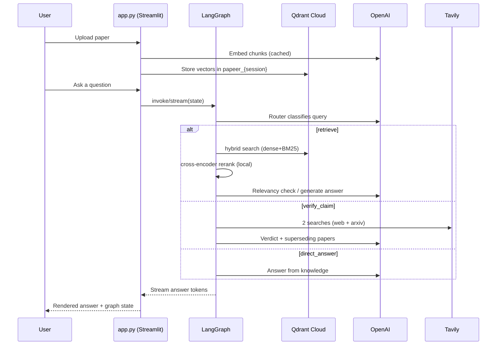
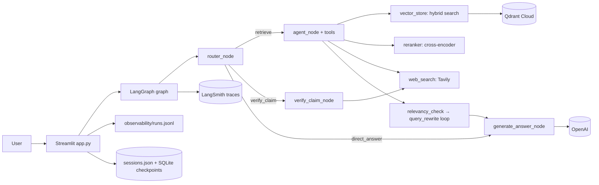
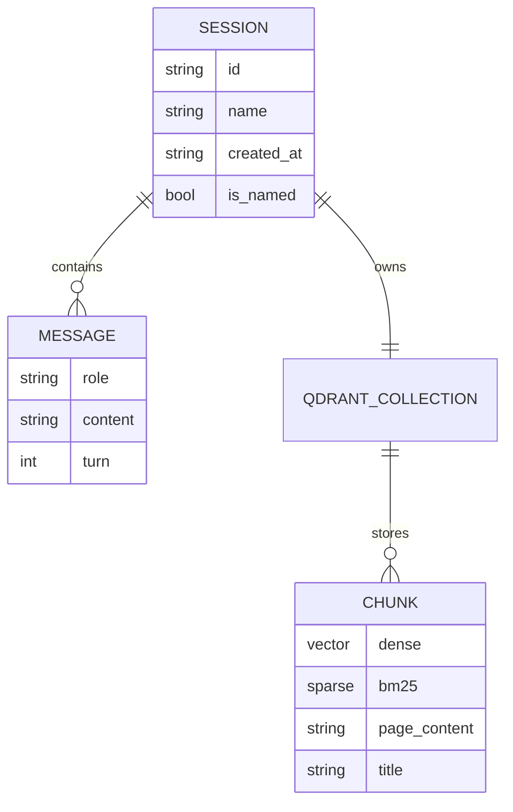

# Project Overview — Papeer

Papeer is a conversational **Retrieval-Augmented Generation (RAG)** assistant for
research papers. A user uploads papers (PDF/TXT/MD, a web URL, or an ArXiv ID) into an
isolated session and then asks questions in natural language. The system routes each
query to one of three behaviours — answer from the paper, verify whether a claim has
been superseded by newer work, or answer general knowledge directly — and streams a
grounded answer back. It is built with **LangGraph + LangChain + Streamlit**, backed by
**Qdrant Cloud** for vectors and **OpenAI** for the LLM and embeddings.

It is a **portfolio / course-capstone project**: a single-user, locally-run prototype
that has been hardened with real evaluation, cost instrumentation, and observability. It
is **not deployed** to a public URL yet (a Docker image and an Azure Container Apps
deployment guide exist and are described in §17).

---

## 1. Executive Summary

The purpose of Papeer is to let students and researchers *talk to* a paper instead of
reading it linearly, and to check whether a paper's claims still hold. The main workflow
is: upload → chunk → embed → store per session in Qdrant → ask a question → an LLM router
classifies the query → a LangGraph workflow retrieves/verifies/answers → the answer
streams into the Streamlit chat.

The architecture is a **single-process Streamlit app** that builds one cached LangGraph
graph. The graph is an agentic RAG pipeline: a router node, a tool-calling retrieval
agent (vector search + web search), a relevancy gate with a bounded query-rewrite loop,
a claim-verification branch, and a final answer node. State is checkpointed to SQLite per
session; each session gets its own Qdrant collection for isolation.

The most important engineering decisions are: **managed RAG over fine-tuning**
(cheaper, updatable, grounded); **per-session vector collections** for hard isolation; a
**bounded agent loop** (max retrieval attempts + max query rewrites) to stop token
runaway; a **cost-controlled model policy** (`gpt-5-mini` + `text-embedding-3-small`);
and a recent **hybrid retrieval + local cross-encoder reranking** upgrade that runs
entirely on CPU and adds no per-query OpenAI cost.

Current strengths: honest, reproducible evaluation (DeepEval A/B with measured cost),
content-safe observability (local ledger + LangSmith), and clean module boundaries. The
most important limitations: no authentication (single-user assumption), local/ephemeral
state, a single evaluation document, and a downstream answer-gating bug that the
evaluation surfaced (see §13 and §19).

---

## 2. Problem Statement

Academic papers are dense, cross-referential, and slow to read. A reader who only needs
a specific method, number, or comparison still has to scan long PDFs, and separately has
to check whether a paper's conclusions have been overtaken by newer work. Without a tool
like this, users do this manually (Ctrl-F in a PDF, Google Scholar, reading related
work) or paste chunks into a generic chatbot that has no grounding in the actual document
and no memory across the conversation.

Papeer removes three frictions: (1) it grounds answers in the *specific* uploaded paper
via retrieval, reducing hallucination; (2) it keeps per-session context so follow-up
questions work; and (3) it adds an explicit *claim-verification* path that searches the
live web and ArXiv to flag superseded findings. The project assumes a **technically
comfortable single user** running it locally with their own API keys — there is no
multi-tenant or account model.

---

## 3. Target Users and Use Cases

**Primary users (verified from the README and UI):** students reading dense papers, and
researchers cross-referencing claims. **Secondary users (inferred):** literature
reviewers checking whether older methods still hold.

**Verified use cases (present in code):**
- Ask grounded questions about an uploaded paper (`retrieve` route → vector search).
- Verify whether a claim is superseded (`verify_claim` route → two Tavily searches → LLM verdict + superseding-paper links).
- Ask for current/live information (`retrieve` route → `web_search` tool).
- Ask a general-knowledge question with no retrieval (`direct_answer` route).
- Off-topic side questions via the `/btw` command, deliberately **not** saved to session history (`backend/btw_handler.py`).
- Run multiple independent sessions, each with its own papers and history.

**Inferred use case:** comparing several papers in one session by loading multiple
documents into the same Qdrant collection.

There is **no admin/operational user** — the app has no roles or management surface.

---

## 4. Core User Journey

Primary journey — *ask a question about an uploaded paper*:

1. **Upload** (sidebar): the user adds a PDF/TXT/MD, a URL, or an ArXiv ID. `app.py`
   writes uploads to a temp file, `backend/paper_loader.py` loads and chunks
   (RecursiveCharacterTextSplitter, 1000/200), and `backend/vector_store.add_paper`
   embeds (cached) and stores into the session's Qdrant collection `papeer_{session_id}`.
   *Failure points:* bad PDF parse, network to Qdrant/OpenAI, ArXiv lookup.
2. **Ask** (chat input): `app.py` appends the user message and invokes the cached graph
   with a fresh input state.
3. **Route:** `router_node` (LLM structured output) classifies into
   `retrieve | verify_claim | direct_answer`.
4. **Retrieve:** the agent calls `retrieve_from_vectorstore` (hybrid + rerank) and/or
   `web_search`; a relevancy gate decides whether to answer or rewrite the query (bounded).
5. **Answer:** `generate_answer_node` composes the grounded answer; tokens stream into the
   chat via `graph.stream(..., stream_mode="messages")`.
6. **Observe:** `record_run` writes a secret-free row (route, latency, tokens, est. cost)
   to `observability/runs.jsonl`; LangSmith captures the trace. A per-turn expander shows
   the serialized graph state.
   *Failure points:* OpenAI/Tavily errors, empty retrieval, the relevancy-gate fallback.

---

## 5. Feature Breakdown

**Fully implemented (verified in code):**
- **Multi-source ingestion** — `backend/paper_loader.py` (PyMuPDF for PDF, TextLoader,
  WebBaseLoader, ArXiv via the Atom API + PDF download).
- **Agentic routing & retrieval** — `backend/rag_graph.py` (router, tool-calling agent,
  relevancy gate, bounded query rewrite, claim verification, answer node).
- **Hybrid retrieval + reranking** — `backend/vector_store.py` + `backend/reranker.py`
  (dense + BM25 sparse via `FastEmbedSparse`, then a local cross-encoder reranks to top-N).
  Config-toggled (`RETRIEVAL_MODE`, `RERANK_ENABLED`).
- **Claim verification** — two Tavily searches (general + `site:arxiv.org`) → structured
  `ClaimVerificationResult`.
- **Multi-session UI + persistence** — `app.py` (sessions in `sessions.json`, chat state
  in SQLite via LangGraph checkpointer), auto session naming, `/btw` side channel,
  streaming, graph-state inspector.
- **Embedding cache** — `CacheBackedEmbeddings` + `LocalFileStore`.
- **Evaluation harness** — `evaluate.py` (DeepEval, curated goldens, baseline-vs-improved
  A/B, measured cost, `--compare`).
- **Observability** — `backend/telemetry.py` (JSONL ledger) + `backend/tracing.py`
  (content-safe LangSmith spans) + `backend/logging_config.py`.
- **Containerization** — `Dockerfile` (health check, pre-cached models).

**Partially implemented:** session **switching** in the UI exists but was not
click-tested end-to-end this session; **LangSmith** tracing is verified landing but the
dashboard was not manually inspected.

**Planned / not present:** authentication, deployment to Azure (guide written, not
executed), multi-paper and web/claim evaluation cases, Prometheus/Grafana (deliberately
deferred).

---

## 6. Technology Stack

| Layer | Technology | Where It Is Used | Why It Fits | Trade-Offs |
|---|---|---|---|---|
| UI | Streamlit | `app.py` | Fastest path to a chat UI with state and streaming for a solo project | Single-process, stateful, hard to scale horizontally; no auth |
| Orchestration | LangGraph | `backend/rag_graph.py` | Explicit stateful graph with loops (retry/rewrite) and checkpointing | More concepts than a simple chain; graph correctness needs care |
| LLM framework | LangChain (+ langchain-openai) | throughout backend | Tool calling, structured output, embeddings, tracing hooks | Version churn; abstraction overhead |
| LLM | OpenAI `gpt-5-mini` | router, agent, answer, verify, rename, eval | Cost-sensitive but capable; structured output + tools | Probabilistic; per-token cost; snapshot drift |
| Embeddings | OpenAI `text-embedding-3-small` (1536-d) | `backend/vector_store.py` | Cheap, good quality; cache-friendly | Changing model forces Qdrant re-index |
| Vector DB | Qdrant Cloud | per-session collections | Managed, supports hybrid dense+sparse | External dependency; per-collection design can accumulate |
| Sparse + rerank | fastembed (BM25 + ONNX cross-encoder) | `backend/reranker.py` | Local, CPU, free; standard production RAG pattern | Adds latency + image size; CPU-bound |
| Web search | Tavily | `web_search`, `verify_claim`, `/btw` | Simple search API with basic/advanced depth | Credit-limited; external quality varies |
| State | SQLite (LangGraph checkpointer) + `sessions.json` | `app.py`, graph | Zero-setup local persistence | Ephemeral in a container; single-node |
| Eval | DeepEval | `evaluate.py` | LLM-judged RAG metrics with per-metric cost | Judge is itself an LLM (cost, variance) |
| Observability | LangSmith + JSONL ledger | `backend/tracing.py`, `telemetry.py` | Traces + a secret-free local cost ledger | LangSmith sends content externally (user-accepted) |
| Container | Docker | `Dockerfile` | Reproducible deploy artifact | Large image (~ full python + models) |

Motivations are phrased as *likely* — the original author's exact reasoning is not
documented in the repo.

---

## 7. High-Level Architecture

Responsibilities: `app.py` owns the UI, session lifecycle, and per-turn telemetry;
`rag_graph.py` owns the decision workflow; `vector_store.py` + `reranker.py` own
retrieval; `paper_loader.py` owns ingestion; `telemetry.py`/`tracing.py`/`logging_config.py`
own observability; `config.py` centralizes all tunables.

---

## 8. Module and Folder Map

| Path | Responsibility | Important Notes |
|---|---|---|
| `app.py` | Streamlit UI, sessions, streaming, per-turn telemetry | Entry point; builds the cached graph |
| `backend/rag_graph.py` | LangGraph workflow (router, agent, relevancy, rewrite, verify, answer) | Core logic; bounded loops |
| `backend/vector_store.py` | Qdrant dense/hybrid retrieval + two-stage `retrieve()` | Per-session collections; rerank integration |
| `backend/reranker.py` | Local cross-encoder rerank (fastembed ONNX) | No OpenAI cost; lazy-loaded |
| `backend/paper_loader.py` | PDF/TXT/MD/URL/ArXiv loading + chunking | 1000/200 splitter |
| `backend/btw_handler.py` | `/btw` off-topic side channel | Not stored in history |
| `backend/models.py` | Pydantic schemas for routing/verification | Structured LLM outputs |
| `backend/config.py` | Central config (models, retrieval, cost estimates) | Env-overridable |
| `backend/telemetry.py` | Secret-free JSONL run/cost ledger | Token + cost capture |
| `backend/tracing.py` | Content-safe LangSmith spans | Logs counts, not content |
| `evaluate.py` | DeepEval A/B harness + `--compare` | Curated goldens, measured cost |
| `goldens_curated.json` | Hand-audited eval questions | 7 cases |
| `tests/` | History + reranker regression tests | Verified passing this session |
| `Dockerfile`, `azure/` | Container + deployment guide | Not yet deployed |

A new engineer should start at `app.py` → `backend/rag_graph.py` → `backend/vector_store.py`.

---

## 9. Data Model

There is no relational database. State lives in four places:

- **Session metadata** — `sessions.json`: `{id, name, created_at, is_named}` per session.
- **Conversation state** — LangGraph `RAGState` (a `MessagesState` subclass) checkpointed
  to SQLite per `thread_id == session_id`. Fields include `messages`, `query`, `route`,
  `retrieved_docs`, `retrieval_attempts`, `rewrite_count`, `claim_verdict`,
  `superseding_papers`, `answer`, `is_relevant`, `force_retrieval`.
- **Document vectors** — one Qdrant collection per session, `papeer_{session_id}`, holding
  chunk vectors + payload (`page_content`, `metadata.title`). Hybrid collections also carry
  a named BM25 sparse vector.
- **Embedding cache** — `embedding_cache/` keyed by content hash (blake2b).

Lifecycle: sessions persist until the user deletes them; evaluation collections are
deleted after each run; there is no archival/TTL for user collections (a known cleanup gap).

---

## 10. API and Interface Design

Papeer has **no external HTTP API**. The "interfaces" are:
- The **Streamlit UI** (chat input, sidebar loaders, `/btw` command).
- The **LangGraph tools** as typed contracts: `RetrieverInput` (`query`, `k`) and
  `WebSearchInput` (`optimized_query`, `max_results`), validated by Pydantic.
- **Structured LLM outputs**: `RouterDecision`, `RelevancyDecision`,
  `ClaimVerificationResult`, `BtwRouteDecision` in `backend/models.py`.
- The **evaluation CLI**: `evaluate.py` with `--goldens`, `--limit`, `--start`, `--model`,
  `--label`, `--output`, `--compare`.

Error handling is per-call try/except in the UI (upload/URL/ArXiv failures shown as
Streamlit messages) and graceful fallbacks in the graph (e.g., "No relevant documents
found"). There is no versioning, idempotency, or rate limiting — appropriate for a
single-user local app, and a gap for any multi-user future.

---

## 11. Authentication and Authorization

**There is none.** Papeer is a single-user local application. Anyone who can open the
Streamlit port can use it, load documents, and spend the owner's API budget. Session
isolation (`papeer_{session_id}`) is a *data-organization* boundary, **not** a security
boundary — there is no identity, no login, no per-user access control.

This is acceptable for a local prototype but is the single biggest gap for any shared or
deployed version: a public Azure Container Apps URL would be open to the world and would
bill the owner's OpenAI/Tavily accounts. Production would need auth (e.g., Azure Easy Auth
/ an identity provider) in front of the app, plus per-user rate limiting and budget caps.

---

## 12. Important Engineering Decisions

### Decision — Managed RAG instead of fine-tuning
**Evidence:** OpenAI embeddings + Qdrant + retrieval graph; no training code.
**Likely reason:** grounding, freshness, and cost for a solo project.
**Benefit:** answers cite the actual paper; documents can change without retraining.
**Cost:** retrieval quality becomes the bottleneck (exactly what the eval showed).
**Alternative:** fine-tuning or long-context stuffing.
**Reconsider when:** documents are small/fixed and long-context becomes cheaper than retrieval.

### Decision — Per-session Qdrant collection
**Evidence:** `get_collection_name` → `papeer_{session_id}`.
**Likely reason:** hard isolation between chats.
**Benefit:** no cross-session leakage; simple mental model.
**Cost:** collection sprawl; no automatic cleanup for user sessions.
**Alternative:** one collection with a `session_id` payload filter.
**Reconsider when:** many sessions/users — a filtered single collection scales better.

### Decision — Bounded agent loop (max retrieval attempts + max rewrites)
**Evidence:** `MAX_RETRIEVAL_ATTEMPTS`, `MAX_QUERY_REWRITES`, `agent_routing`.
**Likely reason:** prevent infinite tool-calling / token runaway.
**Benefit:** predictable cost and latency ceilings.
**Cost:** may stop before finding the best evidence.
**Alternative:** confidence-based stopping.
**Reconsider when:** quality matters more than a hard cost ceiling.

### Decision — Cost-controlled model policy (`gpt-5-mini` + `text-embedding-3-small`)
**Evidence:** `backend/config.py` defaults + `MODEL_PRICING_USD_PER_MILLION`.
**Likely reason:** a real ~$5 budget.
**Benefit:** every run is affordable and measured.
**Cost:** a stronger model might raise answer quality.
**Alternative:** GPT-5.4-mini for a measured quality comparison.
**Reconsider when:** a measured A/B shows the quality gain justifies the price.

### Decision — Hybrid retrieval + local cross-encoder rerank
**Evidence:** `vector_store.retrieve`, `reranker.py`, config flags; A/B in `eval_comparison.md`.
**Likely reason:** the baseline eval showed weak Contextual Relevancy.
**Benefit:** measured gains in precision/recall/answer-relevancy; no per-query OpenAI cost.
**Cost:** higher latency (CPU rerank), larger image.
**Alternative:** LLM-based rerank (costs tokens) or a hosted reranker (Cohere).
**Reconsider when:** latency budget is tight or a GPU/hosted reranker is available.

### Decision — Content-safe, dual observability (local ledger + LangSmith)
**Evidence:** `telemetry.py` (JSONL, hashed session ids) + `tracing.py` (safe spans).
**Likely reason:** measure real cost/latency without leaking keys or paper text into logs.
**Benefit:** honest cost evidence; debuggable traces.
**Cost:** two systems to maintain; LangSmith sends content externally.
**Alternative:** LangSmith only.
**Reconsider when:** a single tool covers both cost accounting and tracing reliably.

---

## 13. Reliability and Failure Handling

- **Ingestion:** per-source try/except in `app.py`; temp files always cleaned in `finally`.
- **Graph:** the agent is forced to execute pending tool calls before finishing to avoid
  orphaned `tool_call` ids corrupting the checkpoint (`agent_routing` comment). Retrieval
  and rewrite loops are bounded.
- **Empty retrieval:** returns a "No relevant documents found" tool message, then the
  answer node can fall back.
- **Known bug (verified by eval):** in `generate_answer_node`, when the relevancy gate is
  false after a rewrite, the app returns a canned *"I wasn't able to find relevant
  information"* answer **even when good chunks were retrieved** (the `security` eval case:
  Precision/Recall 1.0 but the answer said "not found", dropping Faithfulness to 0.667).
  This is the top correctness fix — generate from `retrieved_docs` when non-empty.
- **External dependency failures** (OpenAI/Tavily/Qdrant): mostly surface as exceptions;
  there is no retry/backoff or circuit breaker — a production gap.

---

## 14. Performance and Scalability

- **Expensive steps:** embedding on ingest (network + cost, mitigated by cache), the
  agentic retrieval loop (multiple LLM calls), and DeepEval judging (dominant eval cost).
- **Latency:** measured ~23 s (baseline) to ~35 s (hybrid+rerank) end-to-end per eval
  query; reranking a 20-candidate pool on CPU adds latency.
- **Scaling constraints:** Streamlit is single-process and stateful; SQLite checkpointer
  and `sessions.json` are single-node; per-session Qdrant collections can proliferate.
- **What to measure before optimizing:** per-node latency (LangSmith), reranker time vs.
  candidate-pool size, cache hit rate, and Qdrant query latency. Do not optimize on guesses.

---

## 15. Security and Privacy Review

**Observed:**
- **No authentication/authorization** (see §11) — the biggest risk if deployed.
- **Secrets** are in `.env` (gitignored), read via `os.environ`; never baked into the
  image (Dockerfile uses runtime env); logs and traces are content-safe (hashed session
  ids, counts not content).
- **Prompt-injection surface:** uploaded paper text and web-search results flow into LLM
  prompts; a malicious document/site could try to steer answers. There is no input
  sanitization or output guardrail.
- **SSRF-ish surface:** `web URL` and `ArXiv` loaders fetch arbitrary URLs server-side.
- **Cost abuse:** an open deployment lets anyone spend the owner's API budget.

**General production recommendations (not yet implemented):** put auth in front, add
per-user rate limits and budget caps, validate/limit fetched URLs, and consider prompt-
injection mitigations. These are recommendations, not observed exploits.

---

## 16. Testing and Quality Strategy

- **Existing tests (verified passing this session — 5 passed):** `tests/test_history.py`
  (chat-history reconstruction / duplicate-message prevention) and `tests/test_reranker.py`
  (offline cross-encoder ordering, score metadata, edge cases).
- **Well covered:** the two pure-logic units above (history normalization, rerank).
- **Untested:** the graph end-to-end, routing correctness, ingestion, and the Streamlit UI
  (no integration/E2E tests; external services are not mocked).
- **Evaluation** (`evaluate.py`) is a *quality* harness, not a unit test, but it is the
  strongest quality signal: a reproducible A/B with measured metrics and cost.
- **Recommended pyramid:** more unit tests around routing/gating logic, a few integration
  tests with mocked OpenAI/Qdrant/Tavily, and a thin E2E smoke test of one graph run.

---

## 17. Deployment and Operations

- **Local dev:** `uv sync`; `uv run streamlit run app.py`. Verified booting this session
  (health `200`, UI rendered).
- **Container:** `Dockerfile` installs pinned deps, **pre-caches the BM25 + reranker
  models**, copies the app, exposes 8501, and defines a health check on `/_stcore/health`.
- **Deployment target:** Azure Container Apps, documented step-by-step in
  `azure/DEPLOYMENT.md` (CLI + Portal, secrets as Container App secrets, scale-to-zero for
  cost, budget alerts, teardown). **Not yet deployed** — no billable Azure resource has
  been created.
- **CI/CD:** none (no workflows; not a git repo yet). **Backups/rollback:** none beyond
  Docker image tags. **Monitoring:** LangSmith traces + the local JSONL ledger.

If asked "is it in production?": **no** — it is containerized and deploy-ready, not
deployed.

---

## 18. Current Strengths

- **Honest, reproducible evaluation** — `evaluate.py` runs a controlled baseline-vs-improved
  A/B on hand-audited questions and records measured judge+app cost (`eval_comparison.md`).
- **Content-safe observability** — `telemetry.py`/`tracing.py` capture cost/latency and
  traces without leaking secrets or paper text.
- **Clean module boundaries** — UI, workflow, retrieval, ingestion, and config are separable.
- **Production-style retrieval** — hybrid dense+sparse with cross-encoder reranking, all
  local/free, config-toggled for experimentation.
- **Cost discipline** — central pricing table, per-run cost estimates, bounded loops.
- **Session isolation** — per-session Qdrant collections and checkpoint threads.

---

## 19. Current Limitations and Technical Debt

- **Critical — answer-gating bug:** canned "not found" fires despite good retrieval
  (§13). Impact: wrong answers + faithfulness drop. Fix: answer from `retrieved_docs`
  when non-empty. Acceptable short-term only because it's now diagnosed.
- **High — no authentication:** blocks safe deployment. Impact: open cost/abuse surface.
- **High — thin evaluation:** one document, 5–7 questions. Impact: results are a signal,
  not a benchmark. Improve with multiple papers and more cases.
- **Medium — ephemeral state in a container:** SQLite/cache reset on restart unless Azure
  Files is mounted. Acceptable for a demo.
- **Medium — collection sprawl / no user-session cleanup.** 
- **Medium — no retry/backoff on external calls.**
- **Low — latency of CPU reranking; large Docker image.**

---

## 20. Production Readiness Gap

To move from prototype to production: add **auth + per-user rate/budget limits**; fix the
**answer-gating bug**; add **retry/backoff + timeouts** on OpenAI/Tavily/Qdrant; broaden
**evaluation** (multiple papers, web/claim cases, a CI eval gate); add **CI/CD** and a git
repo; decide **persistence** (Azure Files or a managed store) and **backups**; add
**budget alerts + scale-to-zero** (documented); consider **prompt-injection guardrails**;
and write **operational docs** (runbook, on-call, rollback).

---

## 21. Improvement Roadmap

### Immediate (highest impact, low effort)
- Fix the answer-gating fallback; re-run the same A/B to confirm. *Impact: correctness.
  Complexity: Low. Success: Faithfulness/Relevancy recover in `eval_comparison.md`.*
- Initialize git + push to GitHub; add a minimal CI that runs `pytest`. *Impact:
  credibility/repro. Complexity: Low.*

### Near term
- Add auth + a per-session budget cap before any public deploy. *Impact: safety.
  Complexity: Medium. Depends on: deployment target.*
- Broaden evaluation to 2–3 papers + web/claim cases; track cost per run. *Impact:
  defensible metrics. Complexity: Medium.*
- Add retry/backoff + timeouts around external calls. *Impact: reliability. Complexity: Low–Medium.*

### Medium term
- Move to a filtered single Qdrant collection + session cleanup. *Impact: scale.
  Complexity: Medium.*
- Optional persistence (Azure Files/managed) + backups. *Impact: durability. Complexity: Medium.*
- Tune reranker latency (pool size, lighter model, or GPU/hosted). *Impact: UX. Complexity: Medium.*

Success is measured by the eval metrics, measured latency/cost, and test coverage —
not calendar dates.

---

## 22. Metrics That Should Be Tracked

- **AI quality:** Contextual Precision/Recall/Relevancy, Answer Relevancy, Faithfulness
  (already produced by DeepEval) — because retrieval quality is the core value and risk.
- **Cost:** OpenAI $/query and $/eval, Tavily credits — a real budget constraint.
- **Performance:** end-to-end and per-node latency, reranker time, cache hit rate.
- **Reliability:** external-call error/timeout rate, empty-retrieval rate, fallback rate
  (would have caught the answer-gating bug).
- **Product:** questions/session, route distribution, claim-verification usage.
- **Security (if deployed):** requests/user, budget-cap hits.

Values are intentionally not invented here; the harness and ledger measure them.

---

## 23. Key Project Stories for Interviews

1. **Diagnosing a "win" that wasn't** — Context: added hybrid+rerank expecting a clean
   improvement. Challenge: Contextual Relevancy stayed flat and Faithfulness *dropped*.
   Decision: read per-case results instead of trusting the average. Result: found one case
   where retrieval was correct (P/R = 1.0) but the answer node emitted a canned "not found".
   Learning: measure end-to-end, not just the component you changed. Follow-up: fix the gate.
2. **Cost-first evaluation** — Context: ~$5 budget. Decision: 1-case cost probe → project →
   adaptive N under a hard cap; measure DeepEval's per-metric cost. Result: full A/B for
   ~$0.83, never blowing the ceiling. Learning: instrument cost before running experiments.
3. **Choosing a free, local reranker** — Context: needed better precision without per-query
   cost. Decision: BM25 + ONNX cross-encoder via fastembed over an LLM/hosted reranker.
   Trade-off: latency and image size vs. zero marginal cost. 
4. **Bounded agent loops** — Context: an agent that can rewrite queries can loop forever.
   Decision: hard caps on retrieval attempts and rewrites, and force pending tool calls to
   resolve to avoid corrupting the checkpoint. Learning: agents need guardrails, not just prompts.
5. **Per-session isolation trade-off** — Decision: one Qdrant collection per session for
   simplicity/isolation. Cost: sprawl. When to change: a filtered single collection at scale.
6. **Content-safe observability** — Decision: hash session ids and log counts, not content,
   so cost/latency are visible without leaking paper text or keys.
7. **Honest baseline hygiene** — Kept the old synthetic 10-case results clearly separate
   from current measured runs, so nothing misleading is presented as current.

Where the repo doesn't reveal actual history, treat these as discussion frameworks.

---

## 24. Facts, Inferences, and Assumptions

### Verified from the Repository
- Streamlit + LangGraph + Qdrant + OpenAI + Tavily + DeepEval + LangSmith are actually used.
- Hybrid retrieval + local cross-encoder rerank are implemented and config-toggled.
- The A/B evaluation and its measured numbers exist (`eval_baseline.json`,
  `eval_improved.json`, `eval_comparison.md`).
- Tests pass (5) — verified this session. The app boots locally (health 200).
- No auth, no external HTTP API, no CI/CD, no git repo.

### Strongly Inferred
- Target users are students/researchers; single-user local usage is intended.
- Motivations for model/DB choices are cost + simplicity (not documented verbatim).

### Assumptions Requiring Confirmation
- Whether the project will be deployed publicly (auth becomes mandatory if so).
- Intended concurrency/scale (currently single-user).
- Whether chat-history persistence across restarts matters (drives the Azure Files decision).
