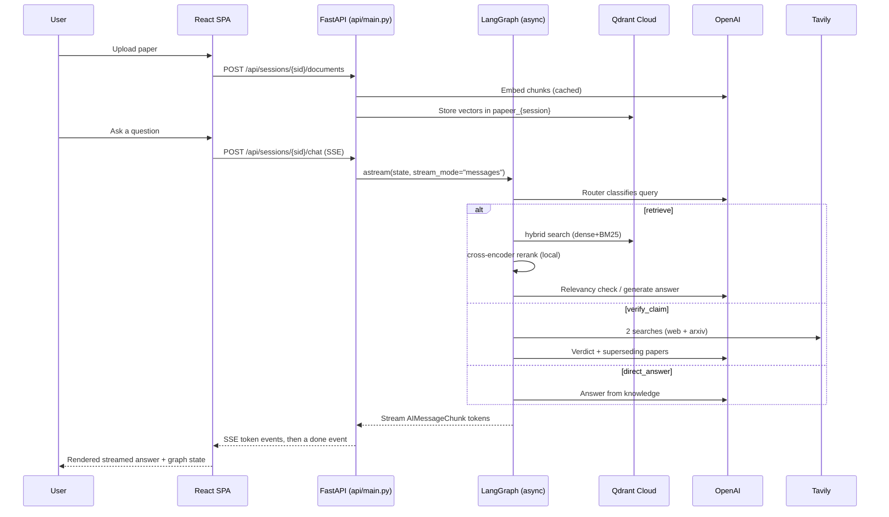
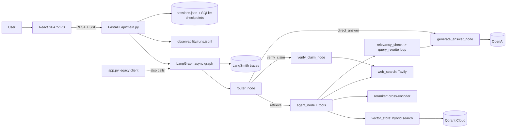
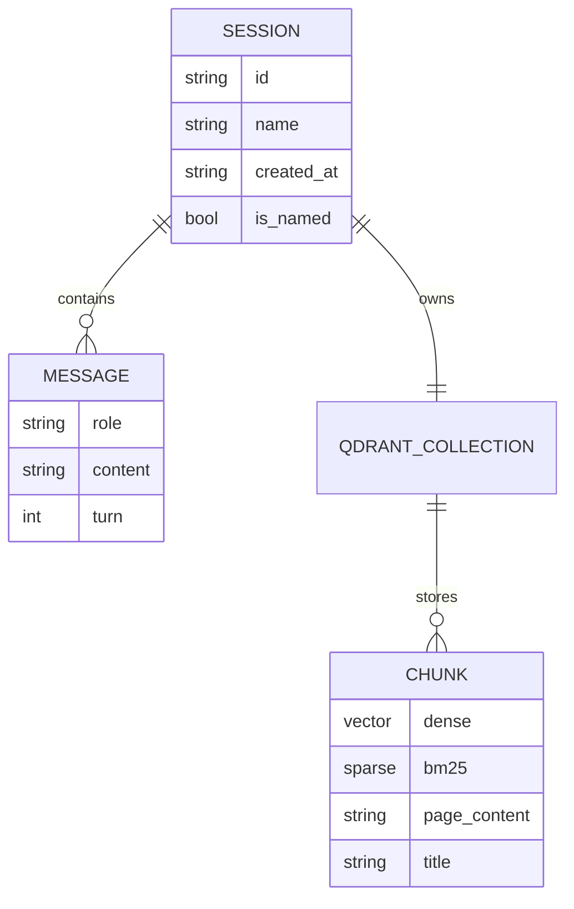

# Project Overview — Papeer

Papeer is a conversational **Retrieval-Augmented Generation (RAG)** assistant for
research papers. A user uploads papers (PDF/TXT/MD, a web URL, or an ArXiv ID) into an
isolated session and then asks questions in natural language. The system routes each
query to one of three behaviours — answer from the paper, verify whether a claim has
been superseded by newer work, or answer general knowledge directly — and streams a
grounded answer back. The backend is **LangGraph + LangChain + FastAPI**, backed by
**Qdrant Cloud** for vectors and **OpenAI** for the LLM and embeddings; the frontend is a
**React + TypeScript SPA** consuming the backend over REST and Server-Sent Events (SSE).

It is a **portfolio / course-capstone project** built to demonstrate full-stack judgment
for SWE roles: a small-scale, no-real-users system that has been hardened with real
evaluation, cost instrumentation, observability, and a production-shaped API/SPA split.
It is **not deployed** to a public URL yet — a Docker image, a verified FastAPI + React
stack, and an Azure Container Apps + Static Web Apps deployment guide (with an
Easy Auth/Entra ID plan) exist and are described in §17.

---

## 1. Executive Summary

The purpose of Papeer is to let students and researchers *talk to* a paper instead of
reading it linearly, and to check whether a paper's claims still hold. The main workflow
is: upload → chunk → embed → store per session in Qdrant → ask a question → an LLM router
classifies the query → a LangGraph workflow retrieves/verifies/answers → the answer
streams token-by-token into the chat UI.

The architecture is a **decoupled REST + SSE API (FastAPI) with a React SPA client**,
both wrapping a single shared LangGraph workflow. The graph is an agentic RAG pipeline: a
router node, a tool-calling retrieval agent (hybrid vector search + web search), a
relevancy gate with a bounded query-rewrite loop, a claim-verification branch, and a
final answer node. Conversation state is checkpointed to SQLite per session (async
checkpointer in the API, sync in evaluation); each session gets its own Qdrant collection
for isolation. A Streamlit app (`app.py`) still exists as the original reference client
and remains functional, but the React SPA is the primary, actively developed UI.

The most important engineering decisions are: **managed RAG over fine-tuning** (cheaper,
updatable, grounded); **per-session vector collections** for hard isolation; a **bounded
agent loop** (max retrieval attempts + max query rewrites) to stop token runaway; a
**cost-controlled model policy** (`gpt-5-mini` + `text-embedding-3-small`); a **hybrid
retrieval + local cross-encoder reranking** upgrade that runs entirely on CPU and adds no
per-query OpenAI cost; and a **UI/backend split** (FastAPI + SSE + React) reusing the
existing backend modules completely unchanged, with a platform-managed **Azure Easy Auth**
plan instead of hand-rolled authentication.

Current strengths: honest, reproducible evaluation (DeepEval A/B with measured cost and an
honestly-reported variance finding), content-safe observability (local ledger +
LangSmith), a verified real-time streaming API, and clean module boundaries. The most
important remaining gaps: the app is not deployed (auth is planned but not yet enforced
by a live platform), there is still no CI pipeline, and the evaluation covers a single
document with a small hand-curated question set (see §19).

---

## 2. Problem Statement

Academic papers are dense, cross-referential, and slow to read. A reader who only needs
a specific method, number, or comparison still has to scan long PDFs, and separately has
to check whether a paper's conclusions have been overtaken by newer work. Without a tool
like this, users do this manually (Ctrl-F in a PDF, Google Scholar, reading related
work) or paste chunks into a generic chatbot that has no grounding in the actual document
and no memory across the conversation.

Papeer removes three frictions: (1) it grounds answers in the *specific* uploaded paper
via retrieval, reducing hallucination; (2) it keeps per-session context so follow-up
questions work; and (3) it adds an explicit *claim-verification* path that searches the
live web and ArXiv to flag superseded findings. The project assumes a **technically
comfortable single user** running it with their own API keys — there is no multi-tenant
account model, though the architecture (REST API + SPA + platform auth) is now shaped to
support one if that requirement ever appeared.

---

## 3. Target Users and Use Cases

**Primary users (verified from the README and UI):** students reading dense papers, and
researchers cross-referencing claims. **Secondary users (inferred):** literature
reviewers checking whether older methods still hold. In practice, the actual "user" of
this deployed instance is expected to be **technical interviewers/reviewers trying the
live demo**, not a real research audience — that shapes some of the trade-offs discussed
throughout (see §11, §19).

**Verified use cases (present in code, exercised through both the Streamlit client and
the React + FastAPI stack this session):**
- Ask grounded questions about an uploaded paper (`retrieve` route → hybrid vector search
  → rerank).
- Verify whether a claim is superseded (`verify_claim` route → two Tavily searches → LLM
  verdict + superseding-paper links).
- Ask for current/live information (`retrieve` route → `web_search` tool).
- Ask a general-knowledge question with no retrieval (`direct_answer` route).
- Off-topic side questions via the `/btw` command, deliberately **not** saved to session
  history (`backend/btw_handler.py`, `api/chat.py`'s `/api/btw`).
- Run multiple independent sessions, each with its own papers and history, switchable
  from a session sidebar.

**Inferred use case:** comparing several papers in one session by loading multiple
documents into the same Qdrant collection.

There is **no admin/operational user** — the app has no roles or management surface.

---

## 4. Core User Journey

Primary journey — *ask a question about an uploaded paper*, as implemented today via the
React SPA and FastAPI backend:

1. **Upload** (sidebar `DocumentPanel`): the user adds a PDF/TXT/MD, a URL, or an ArXiv
   ID. The SPA posts multipart form data (or JSON for URL/ArXiv) to
   `POST /api/sessions/{sid}/documents[...]`; `api/documents.py` writes uploads to a temp
   file, `backend/paper_loader.py` loads and chunks (RecursiveCharacterTextSplitter,
   1000/200), and `backend/vector_store.add_paper` embeds (cached) and stores into the
   session's Qdrant collection `papeer_{session_id}`.
   *Failure points:* bad PDF parse, network to Qdrant/OpenAI, ArXiv lookup — surfaced as
   an HTTP 400 with a message, shown inline in the panel.
2. **Ask** (`MessageInput`): the SPA opens an SSE connection to
   `POST /api/sessions/{sid}/chat` with the message.
3. **Route:** `router_node` (LLM structured output) classifies into
   `retrieve | verify_claim | direct_answer` — unchanged graph logic, shared by both clients.
4. **Retrieve:** the agent calls `retrieve_from_vectorstore` (hybrid search → cross-encoder
   rerank) and/or `web_search`; a relevancy gate decides whether to answer or rewrite the
   query (bounded); the answer node now prefers generating from `retrieved_docs` whenever
   non-empty (fixed this session — see §13).
5. **Answer:** `generate_answer_node` composes the grounded answer; the API streams only
   the incremental `AIMessageChunk` tokens as SSE `token` events (a duplicate-emission bug
   from also forwarding the final aggregated message was found and fixed in both the API
   and the Streamlit client — see §13), then a `done` event carries the final answer, a
   serialized graph-state snapshot, and observability numbers.
6. **Observe:** `record_run` writes a secret-free row (route, latency, tokens, est. cost)
   to `observability/runs.jsonl`; LangSmith captures the trace. The SPA's
   `GraphStateDrawer` renders the per-turn JSON snapshot from the `done` event.
   *Failure points:* OpenAI/Tavily errors (surfaced as an SSE `error` event, rendered
   inline), empty retrieval (falls through to an honest "I don't know" — verified live).

---

## 5. Feature Breakdown

**Fully implemented (verified in code and live-tested this session):**
- **Multi-source ingestion** — `backend/paper_loader.py` (PyMuPDF for PDF, TextLoader,
  WebBaseLoader, ArXiv via the Atom API + PDF download), exposed via `api/documents.py`.
- **Agentic routing & retrieval** — `backend/rag_graph.py` (router, tool-calling agent,
  relevancy gate, bounded query rewrite, claim verification, answer node). The
  answer-gating fallback bug is **fixed**: it now generates from `retrieved_docs` whenever
  non-empty (§13).
- **Hybrid retrieval + reranking** — `backend/vector_store.py` + `backend/reranker.py`
  (dense + BM25 sparse via `FastEmbedSparse`, then a local cross-encoder reranks to top-N).
  Config-toggled (`RETRIEVAL_MODE`, `RERANK_ENABLED`).
- **Claim verification** — two Tavily searches (general + `site:arxiv.org`) → structured
  `ClaimVerificationResult`.
- **FastAPI backend (`api/`)** — session CRUD, document ingestion, SSE-streamed chat and
  `/btw`, a `/health` endpoint, an async LangGraph variant (`build_graph_async` with
  `AsyncSqliteSaver`), CORS, and an auth-identity dependency
  (`api/deps.get_current_user`) that reads the header a platform auth gateway forwards.
  Verified live: all routes respond, sessions persist, documents ingest, and chat streams
  token-by-token end-to-end.
- **React + TypeScript SPA (`frontend/`)** — Vite + React 19 + Tailwind v4. Session
  sidebar (create/switch/delete), document panel (upload/URL/ArXiv + loaded-docs list),
  streaming chat view with Markdown rendering, a `/btw` side channel (ephemeral, cleared
  on session switch), and a per-turn graph-state inspector drawer. `npx tsc -b` and
  `npm run build` both pass cleanly; the app was exercised live in a real browser against
  the running API (see §16 for what "verified" means here).
- **Multi-session persistence** — `sessions.json` for metadata, SQLite via the LangGraph
  checkpointer for conversation state, auto session naming on the first turn (server-side,
  reflected in the SPA by a session-list refresh).
- **Embedding cache** — `CacheBackedEmbeddings` + `LocalFileStore`.
- **Evaluation harness** — `evaluate.py` (DeepEval, curated goldens, baseline-vs-improved
  A/B, measured cost, `--compare`).
- **Observability** — `backend/telemetry.py` (JSONL ledger) + `backend/tracing.py`
  (content-safe LangSmith spans) + `backend/logging_config.py`.
- **Containerization** — `Dockerfile` (health check, pre-cached retrieval models); currently
  packages the Streamlit app, with an update to serve the FastAPI app planned before deploy.

**Partially implemented / in progress:**
- **Deployment** — Docker image and Azure guide exist (`azure/DEPLOYMENT.md`); no cloud
  resource has actually been created.
- **Azure Easy Auth** — documented and the API already reads the identity header it would
  forward, but no live Azure environment currently enforces it (it isn't deployed yet), so
  today the app is unauthenticated wherever it runs.
- **LangSmith** — tracing verified landing via the SDK; the web dashboard itself was not
  manually inspected.

**Planned / not present:** CI pipeline (no GitHub Actions workflow yet, despite a git repo
now existing), multi-paper and web/claim evaluation cases, Prometheus/Grafana
(deliberately deferred), automated frontend/E2E tests (verification this session was
live-but-manual, not an automated suite — see §16).

---

## 6. Technology Stack

| Layer | Technology | Where It Is Used | Why It Fits | Trade-Offs |
|---|---|---|---|---|
| Frontend | React 19 + TypeScript + Vite + Tailwind v4 | `frontend/src/` | Modern SPA stack; strong signal for full-stack/SWE roles; fast dev loop | More moving parts than a single Streamlit script; needs its own build/deploy |
| Frontend streaming | `@microsoft/fetch-event-source` | `frontend/src/api.ts` | Native `EventSource` is GET-only; this supports SSE over POST with a body | Extra dependency vs. a raw `fetch` + manual stream reader |
| Backend API | FastAPI + Starlette `StreamingResponse` | `api/` | Async-native, typed, streams SSE naturally, minimal boilerplate over the existing backend | Introduces an async graph variant to maintain alongside the sync one |
| Legacy UI | Streamlit | `app.py` | Fastest original path to a chat UI; still functional as a reference client | Single-process, stateful, hard to scale horizontally — superseded by the SPA+API split |
| Orchestration | LangGraph (sync + async checkpointers) | `backend/rag_graph.py` | Explicit stateful graph with loops (retry/rewrite) and checkpointing, shared by both clients | Two checkpointer variants (`SqliteSaver`/`AsyncSqliteSaver`) to keep in sync |
| LLM framework | LangChain (+ langchain-openai) | throughout backend | Tool calling, structured output, embeddings, tracing hooks | Version churn; abstraction overhead |
| LLM | OpenAI `gpt-5-mini` | router, agent, answer, verify, rename, eval | Cost-sensitive but capable; structured output + tools | Probabilistic; per-token cost; snapshot drift |
| Embeddings | OpenAI `text-embedding-3-small` (1536-d) | `backend/vector_store.py` | Cheap, good quality; cache-friendly | Changing model forces Qdrant re-index |
| Vector DB | Qdrant Cloud | per-session collections | Managed, supports hybrid dense+sparse | External dependency; per-collection design can accumulate |
| Sparse + rerank | fastembed (BM25 + ONNX cross-encoder) | `backend/reranker.py` | Local, CPU, free; standard production RAG pattern | Adds latency + image size; CPU-bound |
| Web search | Tavily | `web_search`, `verify_claim`, `/btw` | Simple search API with basic/advanced depth | Credit-limited; external quality varies |
| State | SQLite (LangGraph checkpointer) + `sessions.json` | `api/`, `app.py`, graph | Zero-setup persistence | Ephemeral in a container; single-node |
| Auth (planned) | Azure Easy Auth (Entra ID, multi-tenant) / Static Web Apps auth | `azure/DEPLOYMENT.md`, `api/deps.py` | Platform-managed, zero app auth code, free on the student plan | Not yet enforced anywhere live; local dev has no gate |
| Eval | DeepEval | `evaluate.py` | LLM-judged RAG metrics with per-metric cost | Judge is itself an LLM (cost, variance — see §16, §19) |
| Observability | LangSmith + JSONL ledger | `backend/tracing.py`, `telemetry.py` | Traces + a secret-free local cost ledger | LangSmith sends content externally (user-accepted) |
| Container | Docker | `Dockerfile` | Reproducible deploy artifact | Currently targets Streamlit; needs an update to run `uvicorn api.main:app` |

Motivations are phrased as *likely* — the original author's exact reasoning is not
documented in the repo, except where this session's own decisions are described directly.

---

## 7. High-Level Architecture

Responsibilities: `api/main.py` owns HTTP wiring, CORS, and the app lifespan (builds the
async graph once); `api/sessions.py`, `documents.py`, `chat.py` own the three endpoint
groups; `frontend/` owns all UI rendering and client-side state; `rag_graph.py` owns the
decision workflow (unchanged by the migration); `vector_store.py` + `reranker.py` own
retrieval; `paper_loader.py` owns ingestion; `telemetry.py`/`tracing.py`/`logging_config.py`
own observability; `config.py` centralizes all tunables. `app.py` (Streamlit) still calls
the same graph directly and keeps working as a secondary client.

---

## 8. Module and Folder Map

| Path | Responsibility | Important Notes |
|---|---|---|
| `frontend/src/App.tsx` | SPA shell: session state, layout | Composes the hooks + components below |
| `frontend/src/hooks/` | `useSessions`, `useChat`, `useBtw` | Client-side state; SSE consumption; StrictMode-safe bootstrap |
| `frontend/src/components/` | Sidebar, chat view, message input, document panel, graph-state drawer, auth badge | React 19 function components, Tailwind-styled |
| `frontend/src/api.ts` | Typed API client | REST calls + `fetchEventSource`-based SSE streaming |
| `api/main.py` | FastAPI app, CORS, lifespan (builds the async graph once) | Entry point for `uvicorn api.main:app` |
| `api/chat.py` | SSE chat + `/btw` endpoints | Forwards only `AIMessageChunk` tokens (bug fixed this session) |
| `api/documents.py`, `api/sessions.py` | Ingestion and session CRUD endpoints | Thin wrappers over unchanged backend modules |
| `api/session_store.py` | Session metadata + history helpers | Lifted out of the old `app.py` for reuse by both clients |
| `app.py` | Streamlit UI (legacy/reference client) | Still functional; same graph, same fixes applied |
| `backend/rag_graph.py` | LangGraph workflow (router, agent, relevancy, rewrite, verify, answer) | Core logic; bounded loops; now has both `build_graph` (sync) and `build_graph_async` |
| `backend/vector_store.py` | Qdrant dense/hybrid retrieval + two-stage `retrieve()` | Per-session collections; rerank integration |
| `backend/reranker.py` | Local cross-encoder rerank (fastembed ONNX) | No OpenAI cost; lazy-loaded |
| `backend/paper_loader.py` | PDF/TXT/MD/URL/ArXiv loading + chunking | 1000/200 splitter |
| `backend/btw_handler.py` | `/btw` off-topic side channel (sync generator) | Bridged to async SSE via a thread in `api/chat.py` |
| `backend/models.py` | Pydantic schemas for routing/verification | Structured LLM outputs |
| `backend/config.py` | Central config (models, retrieval, cost estimates) | Env-overridable |
| `backend/telemetry.py` | Secret-free JSONL run/cost ledger | Token + cost capture |
| `backend/tracing.py` | Content-safe LangSmith spans | Logs counts, not content |
| `evaluate.py` | DeepEval A/B harness + `--compare` | Curated goldens, measured cost |
| `goldens_curated.json` | Hand-audited eval questions | 7 cases |
| `tests/` | History + reranker regression tests | Passing (5/5) as of this session |
| `Dockerfile`, `azure/` | Container + deployment guide (Container Apps + Static Web Apps + Easy Auth) | Not yet deployed |

A new engineer should start at `frontend/src/App.tsx` (to see the product surface) →
`api/main.py` → `backend/rag_graph.py` → `backend/vector_store.py`.

---

## 9. Data Model

There is no relational database. State lives in four places:

- **Session metadata** — `sessions.json`: `{id, name, created_at, is_named}` per session,
  managed by `api/session_store.py` (and, historically, inline in `app.py`).
- **Conversation state** — LangGraph `RAGState` (a `MessagesState` subclass) checkpointed
  to SQLite per `thread_id == session_id` (via `SqliteSaver` in Streamlit/eval, or
  `AsyncSqliteSaver` in the API). Fields include `messages`, `query`, `route`,
  `retrieved_docs`, `retrieval_attempts`, `rewrite_count`, `claim_verdict`,
  `superseding_papers`, `answer`, `is_relevant`, `force_retrieval`.
- **Document vectors** — one Qdrant collection per session, `papeer_{session_id}`, holding
  chunk vectors + payload (`page_content`, `metadata.title`). Hybrid collections also carry
  a named BM25 sparse vector.
- **Embedding cache** — `embedding_cache/` keyed by content hash (blake2b).

Lifecycle: sessions persist until the user deletes them (now via `DELETE
/api/sessions/{sid}`, which also deletes the Qdrant collection); evaluation collections are
deleted after each run; there is no archival/TTL beyond explicit delete (a known gap).

---

## 10. API and Interface Design

Papeer now has a **real REST + SSE HTTP API** (`api/`), consumed by the React SPA:

| Method & Path | Purpose |
|---|---|
| `POST /api/sessions` | Create a session |
| `GET /api/sessions` | List sessions, newest first |
| `GET /api/sessions/{sid}/messages` | Reconstructed visible history for a session |
| `PATCH /api/sessions/{sid}` | Trigger auto-naming from the first message |
| `DELETE /api/sessions/{sid}` | Delete a session and its Qdrant collection |
| `GET /api/sessions/{sid}/documents` | List loaded document titles |
| `POST /api/sessions/{sid}/documents` | Upload file(s) (multipart) |
| `POST /api/sessions/{sid}/documents/url` | Load one or more web URLs |
| `POST /api/sessions/{sid}/documents/arxiv` | Load an ArXiv paper by ID or title |
| `POST /api/sessions/{sid}/chat` | SSE-streamed chat turn (`token`/`done`/`error` events) |
| `POST /api/btw` | SSE-streamed off-topic side channel (not persisted) |
| `GET /health` | Liveness check |

Requests/responses are validated with Pydantic models (`ChatRequest`, `UrlRequest`,
`ArxivRequest`, ...). Streaming responses use `text/event-stream` with `data: {json}\n\n`
frames; the `done` event carries the final answer, a serialized graph-state snapshot, and
per-turn observability (latency, tokens, estimated cost) — verified live end-to-end,
including through a real browser SSE consumer.

**Auth hook:** `api/deps.get_current_user` reads `X-MS-CLIENT-PRINCIPAL-NAME`, the header
Azure Easy Auth / Static Web Apps forwards after sign-in. Locally (no gateway in front) it
falls back to a `"local-dev"` user — so the API itself enforces nothing; the platform is
meant to be the enforcement point (see §11).

**CORS** is configured (`CORS_ORIGINS` env var, defaulting to the local Vite dev origins).
Error handling is FastAPI `HTTPException`s for document endpoints and an SSE `error` event
for chat failures (both rendered inline in the SPA). There is still no versioning,
idempotency keys, or rate limiting — appropriate for a no-real-users demo, and a gap for
any real multi-user future.

The pre-migration "interfaces" (LangGraph tool schemas, structured LLM outputs) are
unchanged and still underpin the graph regardless of which client calls it:
`RetrieverInput`, `WebSearchInput`, `RouterDecision`, `RelevancyDecision`,
`ClaimVerificationResult`, `BtwRouteDecision` in `backend/models.py`. The evaluation CLI
(`evaluate.py`) remains a separate, non-HTTP interface.

---

## 11. Authentication and Authorization

**Not yet enforced anywhere live**, but the architecture is now shaped for it, and this is
a deliberate, documented plan rather than an oversight:

- **The plan (documented in `azure/DEPLOYMENT.md`):** Azure Static Web Apps'
  built-in auth (Entra ID, multi-tenant + personal accounts, so any reviewer can sign in
  with their own Microsoft account) gates the SPA; the linked FastAPI backend on
  Container Apps receives the forwarded identity header. This is **platform-managed** —
  no in-app login code, free on the student plan.
- **The hook already exists:** `api/deps.get_current_user` reads that forwarded header
  today. It just has nothing to enforce locally, since no gateway sits in front of `uvicorn`
  in dev.
- **Today, right now:** anyone who can reach the API or SPA (locally, that's anyone on the
  machine; once deployed but before Easy Auth is turned on, that's anyone with the URL) can
  use it, load documents, and spend the owner's OpenAI/Tavily budget. Session isolation
  (`papeer_{session_id}`) remains a *data-organization* boundary, not a security boundary.

This is acceptable pre-deployment. It becomes the release gate: the app should not be
exposed publicly until Easy Auth is actually turned on for the live resource — that step
has not happened yet (§17).

---

## 12. Important Engineering Decisions

### Decision — Managed RAG instead of fine-tuning
**Evidence:** OpenAI embeddings + Qdrant + retrieval graph; no training code.
**Likely reason:** grounding, freshness, and cost for a solo project.
**Benefit:** answers cite the actual paper; documents can change without retraining.
**Cost:** retrieval quality becomes the bottleneck (what the eval measured directly).
**Alternative:** fine-tuning or long-context stuffing.
**Reconsider when:** documents are small/fixed and long-context becomes cheaper than retrieval.

### Decision — Per-session Qdrant collection
**Evidence:** `get_collection_name` → `papeer_{session_id}`.
**Likely reason:** hard isolation between chats.
**Benefit:** no cross-session leakage; simple mental model.
**Cost:** collection sprawl; no automatic cleanup for user sessions beyond explicit delete.
**Alternative:** one collection with a `session_id` payload filter.
**Reconsider when:** many sessions/users — a filtered single collection scales better.
*(Explicitly out of scope for this migration — a deliberate choice to bound effort.)*

### Decision — Bounded agent loop (max retrieval attempts + max rewrites)
**Evidence:** `MAX_RETRIEVAL_ATTEMPTS`, `MAX_QUERY_REWRITES`, `agent_routing`.
**Likely reason:** prevent infinite tool-calling / token runaway.
**Benefit:** predictable cost and latency ceilings.
**Cost:** may stop before finding the best evidence.
**Alternative:** confidence-based stopping.
**Reconsider when:** quality matters more than a hard cost ceiling.

### Decision — Cost-controlled model policy (`gpt-5-mini` + `text-embedding-3-small`)
**Evidence:** `backend/config.py` defaults + `MODEL_PRICING_USD_PER_MILLION`.
**Likely reason:** a real, small budget.
**Benefit:** every run is affordable and measured.
**Cost:** a stronger model might raise answer quality.
**Alternative:** `gpt-5.4-mini` for a measured quality comparison.
**Reconsider when:** a measured A/B shows the quality gain justifies the price.

### Decision — Hybrid retrieval + local cross-encoder rerank
**Evidence:** `vector_store.retrieve`, `reranker.py`, config flags; A/B in `eval_comparison.md`.
**Likely reason:** the baseline eval showed weak Contextual Relevancy.
**Benefit:** local/free; measured gains in precision, recall, and answer-relevancy, and
fewer retrieved chunks (cheaper to judge and to prompt with).
**Cost:** higher latency (CPU rerank), larger image; and honestly, at n=5 the fine-grained
precision/recall deltas turned out to be within run-to-run noise on a repeat run — a real
limit of this evaluation's sample size, not of the technique (see §16, §19).
**Alternative:** LLM-based rerank (costs tokens) or a hosted reranker (Cohere).
**Reconsider when:** latency budget is tight or a GPU/hosted reranker is available.

### Decision — Content-safe, dual observability (local ledger + LangSmith)
**Evidence:** `telemetry.py` (JSONL, hashed session ids) + `tracing.py` (safe spans).
**Likely reason:** measure real cost/latency without leaking keys or paper text into logs.
**Benefit:** honest cost evidence; debuggable traces.
**Cost:** two systems to maintain; LangSmith sends content externally (user accepted this).
**Alternative:** LangSmith only.
**Reconsider when:** a single tool covers both cost accounting and tracing reliably.

### Decision — FastAPI + SSE + React over staying on Streamlit
**Evidence:** `api/` package, `frontend/` package, `build_graph_async`.
**Likely reason:** targeting SWE roles where full-stack breadth (a real API, a modern SPA,
streaming, an auth story) is evaluated more directly than a data-app framework.
**Benefit:** a decoupled, typed API any client can consume; a much stronger interview
artifact; the backend logic itself did not need to change (it was already Streamlit-free).
**Cost:** two client surfaces to maintain (Streamlit kept as a reference), an async graph
variant to keep behaviourally identical to the sync one, and real frontend build/test
tooling to own.
**Alternative:** stay on Streamlit and invest the same effort in backend hardening instead.
**Reconsider when:** if the project's audience were purely AI/ML-focused, the React layer
would be a lower-priority investment than deeper retrieval/eval work.

---

## 13. Reliability and Failure Handling

- **Ingestion:** per-source try/except (in `app.py` and now in `api/documents.py`, surfaced
  as HTTP 400s); temp files always cleaned in `finally`.
- **Graph:** the agent is forced to execute pending tool calls before finishing to avoid
  orphaned `tool_call` ids corrupting the checkpoint (`agent_routing` comment). Retrieval
  and rewrite loops are bounded.
- **Fixed this session — answer-gating fallback bug:** `generate_answer_node` used to
  return a canned *"I wasn't able to find relevant information"* whenever the relevancy
  gate was false after a rewrite, **even when good chunks had been retrieved** (the
  `security` eval case: Precision/Recall 1.0 but the answer said "not found", dropping
  Faithfulness to 0.667). It now generates from `retrieved_docs` whenever they're
  non-empty, and only falls back when retrieval is genuinely empty. Re-running the
  evaluation confirmed **Faithfulness and Answer Relevancy are 1.0 on all cases** after
  the fix; the fallback path was also exercised live through the SPA against a session
  with a deleted collection and correctly returned "I don't know the answer."
- **Fixed this session — SSE token duplication:** `stream_mode="messages"` emits both
  incremental `AIMessageChunk`s and a final aggregated `AIMessage`; forwarding both
  duplicated every streamed answer. Fixed by filtering to `AIMessageChunk` only, in both
  `api/chat.py` and `app.py` (the same underlying LangGraph behavior affected both clients).
- **Fixed this session — two small React state races**, found via live browser testing:
  (1) the `streaming` flag stayed true for a moment after the SSE `done` event had already
  finalized the message (because it only flipped false when the underlying fetch fully
  closed), causing a brief duplicate "thinking" placeholder; (2) the `/btw` exchange
  persisted visually across a session switch instead of clearing, unlike the Streamlit
  original where it only ever rendered for one script run. Both fixed in
  `frontend/src/hooks/`.
- **Empty retrieval:** returns a "No relevant documents found" tool message; the answer
  node now correctly falls through to an honest "I don't know" only in that case.
- **External dependency failures** (OpenAI/Tavily/Qdrant): mostly surface as exceptions
  (HTTP 400/500 in the API, an SSE `error` event in chat); there is no retry/backoff or
  circuit breaker — a real production gap, unchanged by this migration.

---

## 14. Performance and Scalability

- **Expensive steps:** embedding on ingest (network + cost, mitigated by cache), the
  agentic retrieval loop (multiple LLM calls), and DeepEval judging (dominant eval cost).
- **Latency:** measured ~23 s (baseline) to ~35–38 s (hybrid+rerank) end-to-end per eval
  query; reranking a 20-candidate pool on CPU adds latency. This was felt directly in live
  browser testing — the SSE connection has a real multi-second gap before the first token.
- **Scaling constraints:** the FastAPI backend is async and can serve concurrent requests
  better than the old single Streamlit process, but conversation state is still SQLite +
  `sessions.json` on one node, and per-session Qdrant collections can proliferate — the API
  split improves the *client* story, not yet the *state* story.
- **What to measure before optimizing:** per-node latency (LangSmith), reranker time vs.
  candidate-pool size, cache hit rate, and Qdrant query latency. Do not optimize on guesses.

---

## 15. Security and Privacy Review

**Observed:**
- **No live authentication enforcement** (see §11) — the plan exists and the API hook is
  wired, but nothing currently gates access to either the local dev servers or (once
  deployed) the public URL until Easy Auth is actually turned on.
- **CORS** is now explicit and configurable (`CORS_ORIGINS`) rather than implicit (there
  was no cross-origin surface at all in the single-process Streamlit app).
- **Secrets** are in `.env` (gitignored), read via `os.environ`; never baked into the
  image; logs and traces are content-safe (hashed session ids, counts not content).
- **Prompt-injection surface:** uploaded paper text and web-search results flow into LLM
  prompts; a malicious document/site could try to steer answers. There is no input
  sanitization or output guardrail.
- **SSRF-ish surface:** the web URL and ArXiv loaders fetch arbitrary URLs server-side,
  now reachable via a documented HTTP endpoint rather than only a UI form — a marginally
  larger attack surface than before, worth noting honestly.
- **Cost abuse:** an open deployment lets anyone spend the owner's API budget; this is
  precisely what the Easy Auth plan (§11) exists to close before the app goes public.

**General production recommendations (not yet implemented):** turn on Easy Auth on the
actual deployed resource, add per-user rate limits and budget caps, validate/limit fetched
URLs, and consider prompt-injection mitigations. These are recommendations, not observed
exploits.

---

## 16. Testing and Quality Strategy

- **Existing automated tests (verified passing this session — 5/5):** `tests/test_history.py`
  (chat-history reconstruction / duplicate-message prevention) and `tests/test_reranker.py`
  (offline cross-encoder ordering, score metadata, edge cases). Both are pure-Python, no
  external API calls.
- **Frontend build/type checks (verified this session):** `npx tsc -b` (strict TypeScript
  compilation) and `npm run build` (production Vite bundle) both pass with zero errors.
- **What "verified live" means honestly:** the FastAPI backend and React SPA were exercised
  against a real running stack this session — health checks, session CRUD, document upload,
  full RAG retrieval, `/btw`, and the empty-collection fallback were all confirmed via a
  combination of `curl`, a real browser (accessibility-tree reads, console/network
  inspection, and DOM-level interaction), and direct API calls to cross-check persistence.
  **This was manual, interactive verification, not an automated end-to-end test suite** —
  there is no Playwright/Cypress-style CI-integrated E2E test yet, which is an honest gap.
- **Untested by automation:** the graph end-to-end, routing correctness, and the full
  ingestion path (covered only by manual/live checks so far).
- **Evaluation** (`evaluate.py`) is a *quality* harness, not a unit test, but it is the
  strongest quality signal: a reproducible A/B with measured metrics and cost. This
  session's re-run also surfaced an important limitation of the harness itself: **at n=5,
  a repeat run of the same config showed retrieval-metric swings as large as the
  original "improvement"** — a genuine finding about statistical power, not a flaw to hide.
- **Recommended pyramid:** more unit tests around routing/gating logic, a few integration
  tests with mocked OpenAI/Qdrant/Tavily, an automated E2E smoke test (Playwright) for the
  SPA, and multi-seed evaluation runs for statistically defensible retrieval claims.

---

## 17. Deployment and Operations

- **Local dev today:** `uv sync`; either `uv run streamlit run app.py` (legacy client) or
  `uv run uvicorn api.main:app --port 8010` + `npm run dev` in `frontend/` (primary
  client) — both verified booting and working this session.
- **Container:** `Dockerfile` installs pinned deps and **pre-caches the BM25 + reranker
  models**; it currently still packages and runs the **Streamlit** app. Updating it to run
  `uvicorn api.main:app` and to build/serve the React app (or host it separately on Static
  Web Apps) is the next concrete deployment step, not yet done.
- **Deployment target (documented, not executed):** `azure/DEPLOYMENT.md` describes Azure
  Container Apps for the FastAPI backend (scale-to-zero for cost) and Azure Static Web Apps
  for the React frontend, fronted by Azure Static Web Apps' built-in Entra ID auth, with
  CLI + Portal steps, secrets-as-Container-App-secrets, budget alerts, and teardown
  commands. **No billable Azure resource has been created.**
- **CI/CD:** a git repository now exists (it did not at the start of this session), but
  there is still no GitHub Actions workflow — `pytest` and the frontend build are not yet
  run automatically on push. **Backups/rollback:** none beyond Docker image tags.
  **Monitoring:** LangSmith traces + the local JSONL ledger.

If asked "is it in production?": **no** — it is containerized (for the legacy client) and
has a fully specified, unexecuted deployment plan for the new architecture.

---

## 18. Current Strengths

- **Honest, reproducible evaluation** — `evaluate.py` runs a controlled baseline-vs-improved
  A/B on hand-audited questions, records measured judge+app cost, and this session's
  write-up (`eval_comparison.md`) reports a real limitation (run-to-run variance) instead
  of a cherry-picked win.
- **Content-safe observability** — `telemetry.py`/`tracing.py` capture cost/latency and
  traces without leaking secrets or paper text.
- **A verified, decoupled REST + SSE API** — built and live-tested this session against a
  real React client, reusing the existing backend with zero changes to its core logic.
- **A working React + TypeScript SPA** — typechecked, built, and exercised live: streaming
  chat, sessions, document upload, `/btw`, and the graph-state inspector all function.
- **Clean module boundaries** — the backend was decoupled from any UI framework *before*
  this migration started, which is exactly what made the migration low-risk.
- **Production-style retrieval** — hybrid dense+sparse with cross-encoder reranking, all
  local/free, config-toggled for experimentation.
- **A concrete, cost-aware, platform-native auth plan** — not implemented as app code, but
  specified precisely enough to execute at deploy time.
- **Real bug-finding through testing** — three separate bugs (answer-gating fallback, SSE
  token duplication, two frontend state races) were found and fixed via actual execution
  and live interaction this session, not left as theoretical concerns.

---

## 19. Current Limitations and Technical Debt

- **High — not deployed / auth not enforced.** Impact: no live demo link yet, and until
  Easy Auth is turned on for the real resource, any deployment is an open cost surface.
  Fix: execute `azure/DEPLOYMENT.md`, verify the auth gate live.
- **High — no CI pipeline.** Impact: `pytest` and the frontend build aren't checked
  automatically; regressions could land silently. Fix: a GitHub Actions workflow.
- **High — thin evaluation + newly-quantified variance.** One document, ~5–7 questions;
  this session's repeat run showed retrieval-metric deltas within noise at that sample
  size. Impact: current retrieval claims should be stated as directional, not precise.
  Fix: multi-seed runs and a broader question/document set.
- **Medium — no automated frontend/E2E tests.** This session's verification was live and
  manual; there's no CI-integrated Playwright-style suite yet.
- **Medium — ephemeral state in a container:** SQLite/cache reset on restart unless Azure
  Files is mounted. Acceptable for a demo.
- **Medium — collection sprawl** beyond explicit per-session delete; no TTL.
- **Medium — no retry/backoff on external calls**, unchanged by this migration.
- **Low — Dockerfile still targets Streamlit**, not yet updated for the FastAPI/React stack.
- **Low — latency of CPU reranking; large Docker image.**

---

## 20. Production Readiness Gap

To move from prototype to production: **execute the deployment** (Container Apps +
Static Web Apps, with Easy Auth actually turned on — the single biggest remaining gap);
add a **CI pipeline** (pytest + frontend build, ideally a Playwright smoke test); add
**retry/backoff + timeouts** on OpenAI/Tavily/Qdrant; broaden **evaluation** (multiple
papers, web/claim cases, multi-seed runs, a CI eval gate); decide **persistence** (Azure
Files or a managed store) and **backups**; consider **prompt-injection guardrails**; and
write **operational docs** (runbook, rollback).

---

## 21. Improvement Roadmap

### Immediate (highest impact, low effort)
- Update the Dockerfile to serve `uvicorn api.main:app` and build/serve the React app (or
  split it to Static Web Apps as planned). *Impact: unblocks deployment. Complexity: Low.*
- Add a GitHub Actions workflow running `pytest` and `npm run build`. *Impact:
  credibility/regression safety. Complexity: Low.*
- Execute the Azure deployment and **turn on Easy Auth** before sharing the URL widely.
  *Impact: safety + a real demo link. Complexity: Low–Medium (mostly following the guide).*

### Near term
- Multi-seed evaluation runs (3–5 seeds) to get statistically defensible retrieval deltas.
  *Impact: a genuinely defensible metrics story. Complexity: Medium (budget-gated).*
- Add an automated E2E smoke test (Playwright) covering upload → ask → stream → verify.
  *Impact: catches regressions like the ones found manually this session. Complexity: Medium.*
- Add retry/backoff + timeouts around external calls. *Impact: reliability. Complexity: Low–Medium.*

### Medium term
- Move to a filtered single Qdrant collection + session TTL/cleanup. *Impact: scale.
  Complexity: Medium.* (Explicitly deferred, not forgotten.)
- Optional persistence (Azure Files/managed) + backups. *Impact: durability. Complexity: Medium.*
- Tune reranker latency (pool size, lighter model, or GPU/hosted). *Impact: UX. Complexity: Medium.*
- Broaden evaluation to 2–3 papers + web/claim eval cases. *Impact: defensible metrics
  breadth. Complexity: Medium.*

Success is measured by the eval metrics, measured latency/cost, CI status, and a live,
authenticated demo URL — not calendar dates.

---

## 22. Metrics That Should Be Tracked

- **AI quality:** Contextual Precision/Recall/Relevancy, Answer Relevancy, Faithfulness
  (already produced by DeepEval), ideally averaged over multiple seeds now that
  single-run variance has been directly observed.
- **Cost:** OpenAI $/query and $/eval, Tavily credits — a real budget constraint.
- **Performance:** end-to-end and per-node latency (now including SSE time-to-first-token,
  which is user-visible in the SPA), reranker time, cache hit rate.
- **Reliability:** external-call error/timeout rate, empty-retrieval rate, fallback rate
  (would have caught the answer-gating bug earlier).
- **Product:** questions/session, route distribution, claim-verification usage.
- **Security (post-deployment):** requests/user, budget-cap hits, Easy Auth denial rate.

Values are intentionally not invented here; the harness and ledger measure them.

---

## 23. Key Project Stories for Interviews

1. **Diagnosing a "win" that wasn't, twice** — Context: added hybrid+rerank expecting a
   clean improvement. Challenge: Contextual Relevancy stayed flat and Faithfulness
   *dropped*. Decision: read per-case results instead of trusting the average; found a
   case where retrieval was correct (P/R = 1.0) but the answer node emitted a canned "not
   found" — fixed it. Then, re-running the *same* config to confirm the fix, found the
   retrieval-metric deltas themselves swung as much as the original "improvement" —
   an honest statistical-power finding, reported rather than hidden. Learning: measure
   end-to-end, and don't trust a single run's delta.
2. **Migrating a Streamlit app to FastAPI + React without touching the AI logic** —
   Context: targeting SWE roles that reward full-stack breadth. Decision: because the
   backend had zero framework coupling from the start, the migration was a wrapping
   exercise (new `api/` and `frontend/` packages) rather than a rewrite. Challenge: making
   the LangGraph checkpointer work under `astream`, which needed an async checkpointer
   variant. Result: a working REST+SSE API and SPA, verified live, with the exact same
   graph behavior as the original.
3. **Finding real bugs by actually running the thing** — Context: after building the SPA,
   did live browser testing instead of trusting the code. Found and fixed: an SSE
   double-emission bug (present in both clients, only surfaced by literally reading
   streamed output), a UI state race (streaming flag lagging the `done` event), and a
   session-switch bug (`/btw` state not clearing). Learning: manual, real execution finds
   bugs static review and unit tests miss — and is worth doing before calling something done.
4. **Cost-first evaluation** — Context: a small real budget. Decision: 1-case cost probe →
   project → adaptive N under a hard cap; measure DeepEval's per-metric cost. Result: a
   full A/B plus a validation re-run, never blowing the ceiling. Learning: instrument cost
   before running experiments, every time — not just once.
5. **Choosing a free, local reranker** — Context: needed better precision without
   per-query cost. Decision: BM25 + ONNX cross-encoder via fastembed over an LLM/hosted
   reranker. Trade-off: latency and image size vs. zero marginal cost.
6. **Choosing platform-managed auth over hand-rolled auth** — Context: no real users, but
   auth is expected in a strong SWE portfolio. Decision: Azure Easy Auth / Static Web Apps
   auth (Entra ID) instead of building JWT/session auth in-app. Trade-off: less "I built
   auth" code to show, but a more realistic, lower-risk pattern real teams actually use —
   and it's genuinely free on the student plan.
7. **Bounded agent loops** — Context: an agent that can rewrite queries can loop forever.
   Decision: hard caps on retrieval attempts and rewrites, and force pending tool calls to
   resolve to avoid corrupting the checkpoint. Learning: agents need guardrails, not just prompts.
8. **Honest baseline hygiene** — Kept the old synthetic 10-case results clearly separate
   from current measured runs, so nothing misleading is presented as current — extended
   this session to also flag the migration status of these very preparation docs while
   they were mid-rewrite, rather than silently leaving stale claims in place.

Where the repo doesn't reveal actual history, treat these as discussion frameworks.

---

## 24. Facts, Inferences, and Assumptions

### Verified from the Repository
- Streamlit + LangGraph + Qdrant + OpenAI + Tavily + DeepEval + LangSmith are actually used.
- Hybrid retrieval + local cross-encoder rerank are implemented and config-toggled.
- A FastAPI backend (`api/`) and a React + TypeScript SPA (`frontend/`) exist, both
  verified working live this session (routes, streaming, ingestion, sessions).
- The answer-gating bug and an SSE token-duplication bug are fixed, each confirmed by
  re-running the evaluation and/or live testing.
- The A/B evaluation and its measured numbers exist (`eval_baseline.json`,
  `eval_improved.json`, `eval_comparison.md`), including the honestly-reported
  run-to-run variance finding.
- Automated tests pass (5/5); `tsc -b` and `npm run build` pass cleanly.
- A git repository now exists. There is still no CI workflow, and no Azure resource has
  been created.

### Strongly Inferred
- Target users are students/researchers for the *product concept*; the actual near-term
  audience for the deployed instance is technical interviewers.
- Motivations for model/DB/framework choices are cost, simplicity, and (for the
  FastAPI/React migration specifically) full-stack signal for SWE roles.

### Assumptions Requiring Confirmation
- The exact timing of the actual Azure deployment and whether Easy Auth will be verified
  live before the URL is shared.
- Whether the Dockerfile update (to serve FastAPI/React instead of Streamlit) has happened
  by the time this is read — check `Dockerfile`'s `CMD` directly.
- Whether chat-history persistence across container restarts matters enough to justify
  mounting Azure Files.
